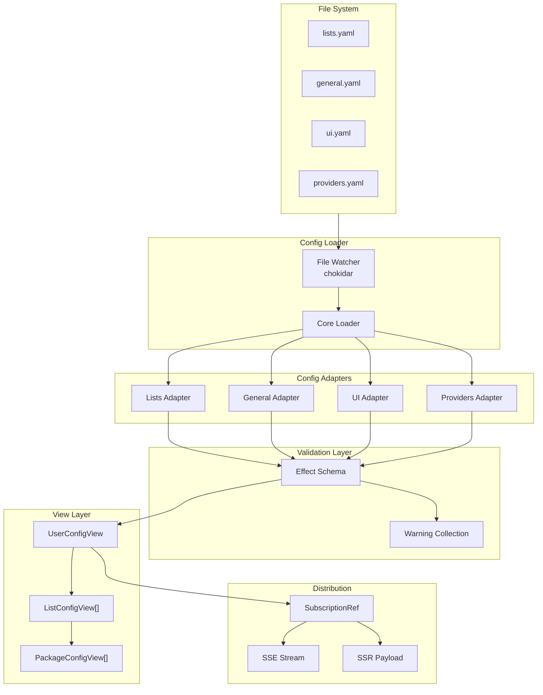

# Config System Deep Dive

The config system is one of the most sophisticated parts of shipped. It provides a reactive, type-safe, and resilient configuration mechanism that never crashes the app due to user error.

## Design Goals

1. **Reactive E2E** - File changes propagate to UI without restart
2. **Graceful Degradation** - Invalid config items are removed, not crashed
3. **Type Safety** - Runtime validation at every step
4. **SSR Compatible** - Config available during server-side rendering
5. **Automatic Recovery** - File watcher never gives up

## Architecture Overview



## The "Never Fail" Philosophy

The config system operates on a simple principle: **user errors should never crash the app**. This is implemented at multiple levels:

### Level 1: Initial Load

The app handles missing or invalid config files gracefully by using defaults:

- **Missing files** - Default config files are created automatically
- **Unparsable files** - Defaults are used, error is logged
- **Bug in loading code** - App fails to start (this is a bug, not user error)

```typescript
// Initial load - graceful recovery
const config =
  yield *
  loadInitialConfig().pipe(
    Effect.catchAll((error) => {
      if (isMissingFile(error)) {
        // Create default config
        return Effect.succeed(createDefaultConfig());
      }
      if (isParseError(error)) {
        // Log error, use defaults
        logger.error("Config parse error, using defaults", error);
        return Effect.succeed(createDefaultConfig());
      }
      // Bug - crash the app
      return Effect.fail(error);
    }),
  );
```

### Level 2: File Watching

Once the app is running, the file watcher takes over. If a reload fails:

- The error is logged
- The **previous config is kept**
- The app continues running

```typescript
// Reload - graceful degradation
const reload = Effect.gen(function* () {
  const newConfig = yield* loadConfig();
  yield* updateConfig(newConfig);
}).pipe(
  Effect.catchAll((error) => {
    // Log error but keep old config
    logger.error("Config reload failed", error);
    return Effect.succeed(void 0);
  }),
);
```

### Level 3: Adapter Validation

Each config adapter validates its own section independently. If one package is invalid, only that package is removed:

```typescript
// Lists adapter - individual package validation
for (const pkg of rawPackages) {
  const validated = validatePackage(pkg);
  if (validated._tag === "Failure") {
    // Add warning, skip this package
    warnings.push({
      message: `Invalid package: ${validated.error.message}`,
      severity: "warning",
    });
    continue;
  }
  packages.push(validated);
}
```

## Config Adapters

Adapters are the heart of the config system. Each adapter handles one config file type and can:

- Parse YAML
- Validate with Effect Schema
- Merge with defaults
- Collect warnings for invalid items
- Transform into view-ready format

### Lists Adapter (`server/infra/config-loader/files/lists.ts`)

The most complex adapter. It:

1. Loads package lists and groups
2. Validates each package against its provider's schema
3. Removes invalid packages with warnings
4. Validates that referenced providers exist

```typescript
// Pseudo-code of lists adapter logic
const parseLists = (yaml: string) =>
  Effect.gen(function* () {
    const raw = parseYaml(yaml);
    const lists: ListConfig[] = [];
    const warnings: ConfigWarning[] = [];

    for (const list of raw.lists) {
      const packages: PackageConfig[] = [];

      for (const pkg of list.packages) {
        // Validate provider exists
        if (!isValidProvider(pkg.provider)) {
          warnings.push({
            message: `Unknown provider "${pkg.provider}" for package "${pkg.name}"`,
            severity: "warning",
          });
          continue;
        }

        // Validate against provider schema
        const validated = yield* validateWithProviderSchema(pkg);
        if (validated._tag === "Failure") {
          warnings.push({
            message: `Invalid package "${pkg.name}": ${validated.error}`,
            severity: "warning",
          });
          continue;
        }

        packages.push(validated);
      }

      lists.push({ ...list, packages });
    }

    return { lists, warnings };
  });
```

### General Adapter

Simple adapter with defaults:

```typescript
const GeneralConfig = Schema.Struct({
  streamConfigChanges: Schema.Boolean.pipe(Schema.optionalWith({ default: () => true })),
  // ... other fields
});
```

### UI Adapter

Handles UI-specific settings:

```typescript
const UIConfig = Schema.Struct({
  maxListsInHeader: Schema.Number.pipe(Schema.optionalWith({ default: () => 3 })),
  // ... other fields
});
```

### Providers Adapter

Manages provider-specific settings and merges extras:

```typescript
// providers.yaml can define global defaults
// These are merged with per-package extras
const ProvidersConfig = Schema.Struct({
  github: Schema.Struct({
    maxReleases: Schema.Number,
    includePrereleases: Schema.Boolean,
  }),
  npm: Schema.Struct({
    tags: Schema.Array(Schema.String),
  }),
});
```

## Effect Schema Server Validation

All server-side configuration data is modeled and validated using Effect Schema:

```typescript
import { Schema } from "effect";

const PackageConfig = Schema.Struct({
  name: Schema.String,
  provider: ProviderName,
  extra: Schema.optionalWith(ProviderExtras, {
    default: () => ({}),
  }),
});

// Runtime validation during file parsing
const result = Schema.decodeUnknownSync(PackageConfig)(rawData);
```

Benefits for Server Configurations:

- **Compile-time types** from schema
- **Runtime validation** of all configuration YAML/JSON data
- **Automatic decoding** from unknown/JSON into Effect structures
- **Composable** - schemas build on each other perfectly in an Effect TS environment

*(Note: While Effect Schema manages server-side validation and logic, client-side boundaries and RPC contracts typically use Zod v4.)*

## View Classes

View classes transform raw config into structured objects with computed properties:

### PackageConfigView

```typescript
class PackageConfigView extends Data.Class<{
  readonly spec: PackageSpec;
  readonly providerExtra: Record<string, unknown>;
}> {
  // Computed hash for this package
  get id(): string {
    return PackageConfigView.hash(this);
  }

  // Human-readable name for debugging
  get displayName(): string {
    return `${this.spec.provider}:${this.spec.name}`;
  }

  // Static hash method
  static hash(config: PackageConfigView): string {
    if (import.meta.dev) {
      // Human-readable in dev mode
      return `${config.spec.name}:${config.spec.provider}:${hash(config.spec.extra)}`;
    }
    // Hashed in production
    return hash({
      spec: config.spec,
      extra: config.providerExtra,
    });
  }
}
```

### ListConfigView

```typescript
class ListConfigView extends Data.Class<{
  readonly slug: string;
  readonly name: string;
  readonly packages: readonly PackageConfigView[];
}> {
  // Computed properties for list
  get packageCount(): number {
    return this.packages.length;
  }
}
```

### UserConfigView

The main aggregation point:

```typescript
class UserConfigView extends Data.Class<{
  readonly general: GeneralConfigView;
  readonly ui: UIConfigView;
  readonly lists: readonly ListConfigView[];
  readonly providers: ProvidersConfigView;
  readonly warnings: readonly ConfigWarning[];
}> {
  // Fast O(1) lookup by package hash
  get packageMap(): ReadonlyMap<string, PackageConfigView> {
    const map = new Map<string, PackageConfigView>();
    for (const list of this.lists) {
      for (const pkg of list.packages) {
        map.set(pkg.id, pkg);
      }
    }
    return map;
  }

  // Get package by hash
  getPackageById(id: string): Option<PackageConfigView> {
    return Option.fromNullable(this.packageMap.get(id));
  }
}
```

## Config Distribution

### SubscriptionRef Pattern

The server uses Effect's `SubscriptionRef` for reactive state:

```typescript
const configRef = SubscriptionRef.make(initialConfig);

// Any update broadcasts to subscribers
yield * configRef.set(newConfig);

// Subscribers receive updates
yield *
  configRef.changes.pipe(
    Stream.runForEach((config) => {
      // Broadcast to all connected clients
    }),
  );
```

### SSR Injection

During SSR, the server injects raw config into Nuxt's payload state:

```typescript
// layers/01-base/app/plugins/02-config.ts (server side)
if (import.meta.server) {
  const rpc = useRPC();
  const userConfig = await rpc.config.get.call();

  // Inject into Nuxt's payload state for hydration
  if (userConfig && nuxtApp?.payload.state) {
    injectUserConfig(nuxtApp.payload.state, userConfig);
  }
}

// Helper functions for injection/extraction
const key = "#USER_CONFIG";

export function injectUserConfig(obj: unknown, data: UserConfig) {
  if (obj && typeof obj === "object") {
    Object.assign(obj, {
      [key]: Schema.encodeSync(UserConfig)(data),
    });
  }
}
```

### Client Hydration

The client extracts config from Nuxt's payload state and reconstructs the view:

```typescript
// layers/01-base/app/plugins/02-config.ts (client side)
if (import.meta.client) {
  const nuxtApp = tryUseNuxtApp();

  // Extract from SSR payload
  const initialData = extractUserConfig(nuxtApp?.payload.state);

  // Apply to reactive ref
  applyConfig(initialData);
}

export function extractUserConfig(obj: unknown): UserConfig | undefined {
  if (obj && typeof obj === "object" && key in obj) {
    try {
      return Schema.decodeUnknownSync(UserConfig)(obj[key]);
    } catch (error) {
      console.warn("Failed to decode config from payload:", error);
    }
  }
}

function applyConfig(userConfig?: UserConfig | null) {
  const decoded = Schema.decodeUnknownOption(UserConfig)(userConfig);
  if (Option.isSome(decoded)) {
    data.value = UserConfigView.make(decoded.value);
  } else {
    error.value = "Failed to apply config";
  }
}
```

### SSE Streaming via ORPC

When `streamConfigChanges` is enabled (default), clients receive real-time updates using ORPC's streaming:

```typescript
// Client side (layers/01-base/app/plugins/02-config.ts)
import { consumeEventIterator } from "@orpc/client";

async function start() {
  if (!isStreamingEnabled.value) return;

  unsubscribeStream = consumeEventIterator(useRPC().config.getStream.call(undefined), {
    onEvent(val) {
      isConnected.value = true;
      streamError.value = undefined;
      applyConfig(val);
    },
    onError: (error) => {
      console.error("Failed to create stream for config:", error);
      streamError.value = error.message;
      isConnected.value = false;

      // Auto-retry
      setTimeout(start, 2000);
    },
    onSuccess(value) {
      // Server closed connection gracefully
      console.log("Stream finished", value);
      isConnected.value = false;
      streamError.value = undefined;
      applyConfig(value);
    },
  });
}
```

```typescript
// Server side - returns EventIterator from SubscriptionRef
const stream = configRef.changes.pipe(
  Stream.map((config) => config), // ORPC handles the streaming
);

return stream;
```

## Error Boundaries

The config system has clear error boundaries:

| Level        | Error Type    | Behavior                   |
| ------------ | ------------- | -------------------------- |
| Initial Load | Missing files | Create defaults            |
| Initial Load | Parse errors  | Use defaults, log error    |
| Initial Load | Bug in code   | App fails to start         |
| File Watch   | Bug in reload | Keep old config, log error |
| Adapter      | Invalid items | Remove item, add warning   |
| Schema       | Type mismatch | Use default, log warning   |
| View         | Logic error   | Fallback to defaults       |

## Making Changes

The config system is designed for easy evolution:

### Adding a New Config Field

1. Update the schema in `libs/config/schemas/`:

```typescript
const GeneralConfig = Schema.Struct({
  existingField: Schema.String,
  newField: Schema.Boolean.pipe(Schema.optionalWith({ default: () => false })),
});
```

2. Access in view class if needed:

```typescript
class GeneralConfigView extends Data.Class<{
  readonly newField: boolean;
}> {}
```

3. Document in `docs/config-files.md`

### Adding a New Config File

1. Create adapter in `server/infra/config-loader/files/`:

```typescript
export const myAdapter: ConfigAdapter<MyConfig> = {
  fileName: "myconfig.yaml",
  parse: (content) =>
    Effect.gen(function* () {
      // Parse and validate
    }),
};
```

2. Add to loader:

```typescript
const adapters = [listsAdapter, generalAdapter, uiAdapter, providersAdapter, myAdapter];
```

3. Add to UserConfig schema and view

## Debugging

### Viewing Current Config

Access the reactive config in Vue DevTools:

- Look for `useUserConfig()` composable
- Inspect `data.value` for current UserConfigView

### Checking Warnings

Warnings are available via the config data:

```typescript
const { data } = useUserConfig();
const warnings = computed(() => data.value?.warnings ?? []);
// warnings - array of all config warnings
```

### File Watcher Status

To check if the file watcher is working:

1. Edit a config file in the `config/` directory
2. Save the file
3. Check browser console for SSE connection status
4. Verify UI updates with new config

You can also check the streaming status via the config composable:

```typescript
const { isConnected, streamError } = useUserConfig();
// isConnected.value - true if actively streaming
// streamError.value - any connection errors
```

## Common Issues

### Config changes not reflecting

1. Check file is in `config/` directory
2. Verify file extension is `.yaml`
3. Check browser console for SSE connection errors
4. Try manual refresh: `useUserConfig().refresh()`

### Warnings not showing

Warnings are only generated during validation. Check:

1. Package provider is valid
2. Package name format matches provider expectations
3. Extra fields match provider schema

## Summary

The config system provides:

- **File-based configuration** with hot reloading
- **Type-safe validation** at every boundary
- **Graceful degradation** for invalid items
- **Reactive distribution** via SSE
- **SSR compatibility** with payload injection

This architecture enables users to iterate on configuration quickly while maintaining system stability.