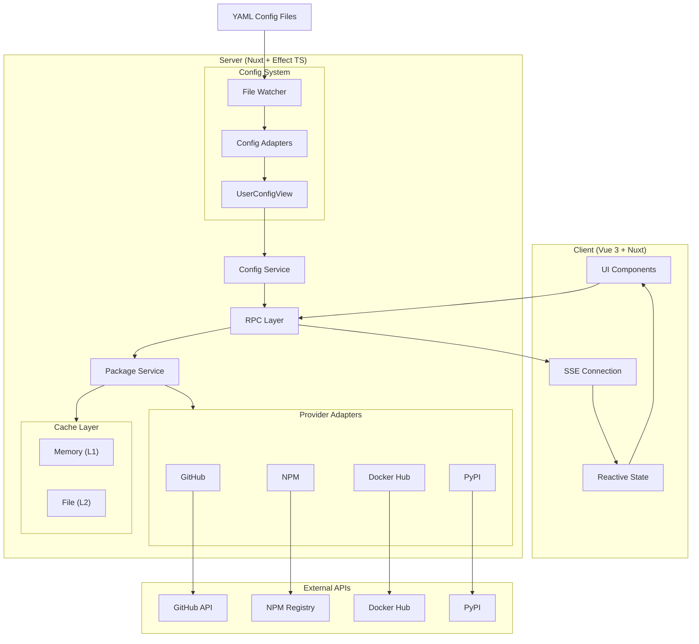

# System Architecture Overview

shipped is a self-hosted release tracking application built with a unique architecture designed for reliability, type safety, and real-time reactivity. This document explains the high-level design and key architectural decisions.

## Core Philosophy

The architecture follows these principles:

1. **Never Fail on User Error** - Configuration errors are isolated and reported, never crash the app
2. **Reactive E2E** - Changes propagate from filesystem to UI without restarts
3. **Type Safety First** - Runtime validation at every boundary
4. **Cache as Database** - External API calls are expensive; cache aggressively
5. **Defense in Depth** - Hash-based package IDs prevent arbitrary API requests

## System Architecture Diagram



## Key Architectural Patterns

### 1. Config-First Design

Unlike traditional apps that store configuration in a database, shipped uses YAML files as runtime configuration. This enables:

- **Easy editing** without UI complexity - just edit files
- **Atomic updates** via file replacement
- **Fast startup** - no database queries needed
- **Hot reloading** - changes reflected immediately without restarts

The config files live in the `config/` directory on your deployed server and are watched for changes.

[Learn more about the Config System](./config-system.md)

### 2. Package Hashing

Packages are identified by a hash of their complete configuration, not by name. This provides:

- **Security** - Only pre-configured packages can be queried
- **Cache Invalidation** - Changing any config property changes the hash
- **Uniqueness** - Same package with different provider settings = different hash

[Learn more about Package System](./package-system.md)

### 3. Effect TS on Server

The server uses Effect TS for all business logic, providing:

- **Typed errors** - Every failure case is explicit
- **Composability** - Effects chain and combine safely
- **Testability** - Easy to mock and test
- **Resource safety** - Automatic cleanup and error handling

### 4. Multi-Layer Caching

Package data is cached in two layers:

- **L1 (Memory)** - Fast access, lost on restart
- **L2 (File)** - Survives restarts, slower

Even "not found" results are cached (with shorter TTL) to avoid hammering external APIs.

### 5. Request Coalescing

Multiple concurrent requests for the same package result in a single external API call:

```
Request A ──┐
Request B ──┼──> Package Service ──> Single API Call
Request C ──┘
```

This prevents thundering herd problems during cache misses.

## Data Flow

### Config Loading Flow

```
1. File System (YAML)
   ↓
2. File Watcher (chokidar) detects change
   ↓
3. Config Adapter parses file
   ↓
4. Effect Schema validates
   ↓
5. Individual errors isolated → Warnings
   ↓
6. UserConfigView aggregates all configs
   ↓
7. SubscriptionRef updated
   ↓
8. SSE broadcasts to clients
   ↓
9. Client updates reactive state
   ↓
10. UI re-renders
```

### Package Fetching Flow

```
1. Client requests package by hash
   ↓
2. Package Service validates hash exists in config
   ↓
3. Cache lookup (L1 → L2)
   ↓
4. Cache miss → Request coalescing check
   ↓
5. Provider adapter fetches from external API
   ↓
6. Response cached (success or not-found)
   ↓
7. Response returned to client
```

## Project Structure

```
shipped/
├── app/                    # Vue application (components, pages, composables)
├── layers/                 # Nuxt layers (01-base/, 02-packages/)
├── libs/                   # Shared business logic (client + server safe)
│   ├── config/            # Config schemas and view classes
│   ├── packages/          # Package types and schemas
│   └── utils/             # General utilities
├── server/                 # Backend code (Effect TS)
│   ├── providers/         # External provider adapters
│   ├── services/          # Business services
│   └── rpc/               # RPC route handlers
├── shared/                 # Client boundary - re-exports from libs
└── config/                 # User configuration files (YAML)
```

### Key Directories Explained

**`libs/` vs `server/libs/`**

- `libs/` - Shared domain logic, no server dependencies, safe for client
- `server/libs/` - Server-only infrastructure (cache, file system, errors)

This split enables the client to use domain types and view classes without bundling server code.

**`layers/` - Nuxt Layer Organization**

- `01-base/` - Core functionality, RPC, config system
- `02-packages/` - Package-specific UI components

Layers provide clean separation while allowing shared configuration.

## Technology Stack

| Layer         | Technology             | Purpose                                                 |
| ------------- | ---------------------- | ------------------------------------------------------- |
| Frontend      | Nuxt 4 + Vue 3         | SSR, routing, UI framework                              |
| Styling       | Tailwind CSS + Nuxt UI | Consistent design system                                |
| Data Fetching | TanStack Query         | Client-side data fetching, caching, and synchronization |
| Backend       | Nuxt Server + Nitro    | API layer                                               |
| Server Logic  | Effect TS              | Functional programming, error handling                  |
| Validation    | Effect Schema & Zod v4 | Effect Schema for server logic, Zod for RPC boundaries  |
| RPC           | ORPC                   | Type-safe API calls                                     |
| Caching       | BentoCache             | Multi-layer caching                                     |
| Config        | chokidar               | Config file watching and hot reloading                  |

## Why This Architecture?

### Why YAML over Database?

- Easy editing without UI complexity
- Hot reloading - changes reflect immediately
- No database migrations for config schema changes
- Simple backup/restore (just copy files)

### Why Effect TS?

Traditional try/catch error handling is implicit and easy to miss. Effect makes errors:

- **Explicit** in the type signature
- **Composable** - errors propagate through chains
- **Recoverable** - easy to catch and handle specific cases

### Why Hash-Based Package IDs?

Security is paramount for self-hosted apps. By requiring packages to be pre-configured:

- Users can't probe arbitrary packages
- API rate limits are predictable
- Configuration drives all behavior

### Why SSE over WebSockets?

Server-Sent Events provide:

- **Simple reconnection** - automatic with EventSource
- **HTTP-based** - works through proxies/firewalls
- **One-way streaming** - perfect for config updates
- **Less overhead** - no handshake for each client

## Next Steps

- [Config System Deep Dive](./config-system.md)
- [Package System Architecture](./package-system.md)
- [Provider Architecture](./providers.md)
- [Layer Structure](./layers.md)
- [Key Design Decisions](./decisions.md)