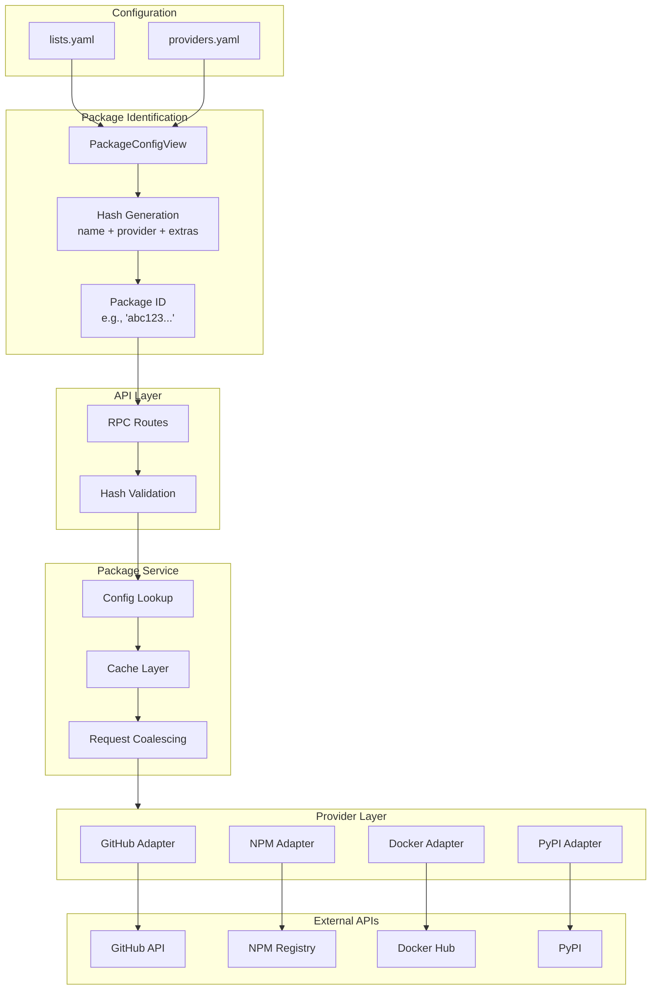
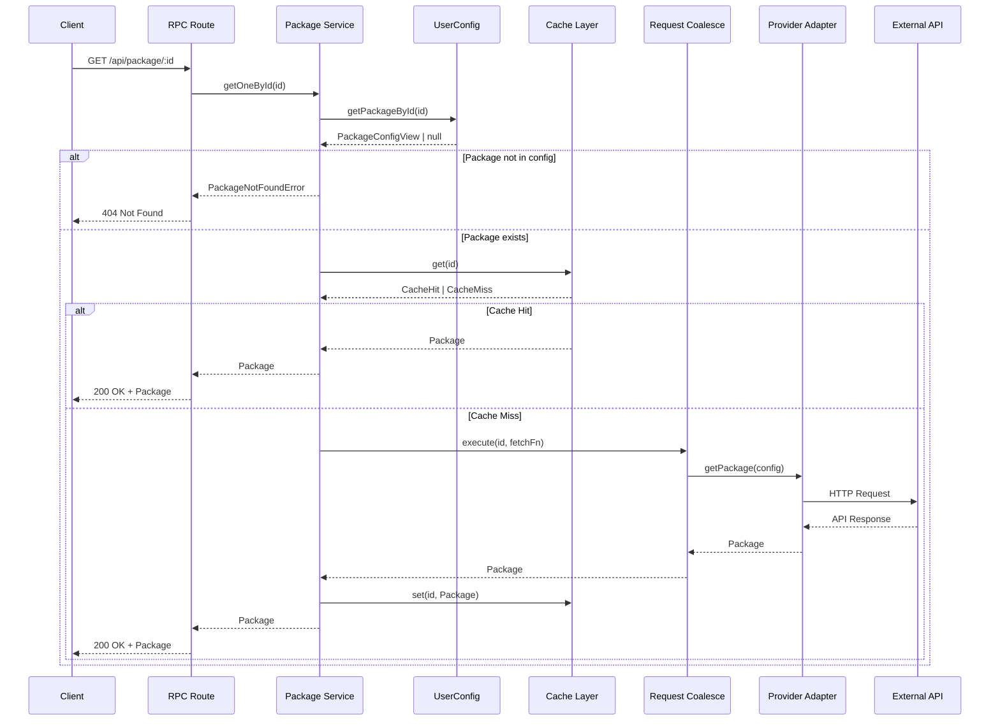

# Package System Architecture

The package system is designed to securely fetch, cache, and serve package release information. It uses a unique hash-based identification system to prevent arbitrary API requests while enabling aggressive caching.

## Design Goals

1. **Security** - Only pre-configured packages can be queried
2. **Cache Efficiency** - Maximize cache hits, minimize API calls
3. **Type Safety** - Full runtime validation of all data
4. **Resilience** - Handle provider failures gracefully
5. **Performance** - Request coalescing prevents duplicate calls

## Architecture Overview



## Package Identification

### Why Hash-Based IDs?

Traditional REST APIs use resource IDs like `/api/packages/vuejs/vue`. This has problems:

1. **Security** - Anyone can query arbitrary packages
2. **Cache Invalidation** - Changing config does not change the URL
3. **Ambiguity** - Same package with different settings = same ID

shipped uses content-addressed hashes:

```
Package ID = hash(name + provider + packageExtras + providerExtras)
```

### What is in the Hash?

The hash includes everything that affects the package data:

```typescript
// Package-level config
{
  name: "vuejs/vue",
  provider: "github",
  extra: {
    includePrereleases: true,
    maxReleases: 10
  }
}

// Provider-level config (from providers.yaml)
{
  github: {
    maxReleases: 50,  // Default for all GitHub packages
    includePrereleases: false
  }
}

// Combined and hashed
const packageId = hash({
  spec: { name, provider, extra },
  providerExtra: { maxReleases, includePrereleases }
});
```

This means:

- `vuejs/vue` with `maxReleases: 10` -> Hash A
- `vuejs/vue` with `maxReleases: 20` -> Hash B (different!)
- Changing any provider setting -> New hash -> Cache miss

### Hash Generation

```typescript
class PackageConfigView {
  get id(): string {
    return PackageConfigView.hash(this);
  }

  static hash(config: PackageConfigView): string {
    if (import.meta.dev) {
      // Human-readable in development
      return `${config.spec.name}:${config.spec.provider}:${hash(config.spec.extra)}:${hash(config.providerExtra)}`;
    }

    // Hashed in production
    return hash({
      spec: config.spec,
      extra: config.providerExtra,
    });
  }
}
```

Dev mode hash example:

```
"vuejs/vue:github:a1b2c3d4:e5f6g7h8"
```

Production hash example:

```
"a1b2c3d4e5f6..."
```

## PackageConfigView

The view class encapsulates all package configuration:

```typescript
class PackageConfigView extends Data.Class<{
  readonly spec: PackageSpec; // name, provider, package-level extras
  readonly providerExtra: Record<string, unknown>; // provider-level defaults
}> {
  // Unique identifier (computed hash)
  readonly id: string;

  // Provider name for routing
  get providerName(): string {
    return this.spec.provider;
  }

  // Package name (format varies by provider)
  get name(): string {
    return this.spec.name;
  }

  // Display name for UI
  get displayName(): string {
    return `${this.spec.provider}:${this.spec.name}`;
  }
}
```

## The Package Map

UserConfigView creates a fast lookup map:

```typescript
class UserConfigView {
  get packageMap(): ReadonlyMap<string, PackageConfigView> {
    const map = new Map<string, PackageConfigView>();

    for (const list of this.lists) {
      for (const pkg of list.packages) {
        map.set(pkg.id, pkg); // O(1) lookup by hash
      }
    }

    return map;
  }
}
```

This enables constant-time validation:

```typescript
// Validate package exists
const pkg = userConfig.packageMap.get(packageId);
if (!pkg) {
  return Effect.fail(new PackageNotFoundError({ id: packageId }));
}
```

## Package Service Flow



## Cache Architecture

### Multi-Layer Caching

```
Request
  ↓
┌─────────────────────────────────────────┐
│ L1 Cache (Memory)                       │
│ - In-memory Map                         │
│ - Fastest access                        │
│ - Lost on restart                       │
└─────────────────────────────────────────┘
  ↓ (miss)
┌─────────────────────────────────────────┐
│ L2 Cache (File)                         │
│ - BentoCache with file backend          │
│ - Survives restarts                     │
│ - Slower than L1                        │
└─────────────────────────────────────────┘
  ↓ (miss)
External API Call
```

### Cache Key Structure

```typescript
// Namespace includes provider and implementation versions
const namespace = `${providerName}-${providerVersion}-package_v${implVersion}`.replace(/[^a-zA-Z0-9]/g, "-");

// Key is the package hash
const key = packageId;

// Full cache key: "github-1-2-package-v-3" + ":" + "abc123..."
```

Why include versions?

- Provider schema changes -> New namespace -> Cache miss
- Implementation changes -> New namespace -> Cache miss
- Prevents stale data when code changes

### TTL Strategy

```typescript
const CACHE_TTL = {
  // Successful fetches cached longer
  success: 3 * 60 * 60 * 1000, // 3 hours

  // Not found cached shorter (might be temporary)
  notFound: 10 * 60 * 1000, // 10 minutes

  // Errors cached briefly (avoid hammering failing APIs)
  error: 60 * 1000, // 1 minute
};
```

Caching `undefined` (not found) is critical - prevents repeated failed API calls for:

- Typos in package names
- Deleted packages
- Non-existent versions

### Request Coalescing

When multiple requests hit the same cache miss:

```
Time →

Request A ─────┐
Request B ─────┼───> Single API Call ───> All Get Result
Request C ─────┘
```

Implementation using Effect's concurrency primitives:

```typescript
const coalescingMap = new Map<string, Promise<Package>>();

const fetchWithCoalescing = (id: string, fetchFn: () => Promise<Package>) => {
  if (coalescingMap.has(id)) {
    return coalescingMap.get(id)!;
  }

  const promise = fetchFn().finally(() => {
    coalescingMap.delete(id);
  });

  coalescingMap.set(id, promise);
  return promise;
};
```

This prevents thundering herd when:

- Multiple users open the same package simultaneously
- Cache expires and multiple requests arrive
- Server restarts and cache is cold

## Provider Adapter Interface

Each provider implements a standard interface:

```typescript
interface PackageProvider<T extends ProviderInfo> {
  readonly info: T;
  readonly version: string;

  // Fetch package data
  getPackage: (config: PackageConfigView) => Effect.Effect<Package, ProviderError>;
}
```

### Data Flow Through Provider

```
PackageConfigView
       ↓
  + provider-specific parsing
       ↓
Provider Internal Config
       ↓
  + API call
       ↓
Raw API Response
       ↓
  + Validation with Provider Schema
       ↓
Package (unified format)
```

All providers return the same `Package` structure:

```typescript
interface Package {
  overview: PackageOverview; // name, description, url, etc.
  releases: PackageRelease[]; // version, date, notes, etc.
}
```

## Security Model

### Hash Validation

The API never accepts arbitrary package identifiers:

```typescript
// RPC Route
const getPackage = o.router({
  getOneById: o.procedure.input(z.object({ id: z.string() })).handler(({ input }) =>
    Effect.gen(function* () {
      const config = yield* UserConfigService;

      // CRITICAL: Only allow pre-configured packages
      const pkg = config.getPackageById(input.id);
      if (pkg._tag === "None") {
        return yield* Effect.fail(
          new PackageNotFoundError({
            id: input.id,
          }),
        );
      }

      // Proceed with fetching
      return yield* packageService.getOneById(input.id);
    }),
  ),
});
```

### Why This Matters

Without hash validation, users could:

- Query any package on GitHub/NPM (security risk)
- Exhaust API rate limits by requesting random packages
- Probe for private package names

With hash validation:

- Only packages in `lists.yaml` can be queried
- Attacker cannot guess valid hashes (cryptographically secure)
- API rate limits are predictable and controlled

## Error Handling

### Error Types

```typescript
// Package not found in config
class PackageNotFoundError extends Data.TaggedError("PackageNotFoundError")<{
  id: string;
}> {}

// Provider API error
class ProviderError extends Data.TaggedError("ProviderError")<{
  provider: string;
  message: string;
  cause?: unknown;
}> {}

// Cache error
class CacheError extends Data.TaggedError("CacheError")<{
  operation: "get" | "set";
  key: string;
  cause: unknown;
}> {}
```

### Error Recovery

```typescript
const getPackageSafe = (id: string) =>
  Effect.gen(function* () {
    const result = yield* getPackage(id).pipe(
      // Handle specific errors
      Effect.catchTag("PackageNotFoundError", (e) => Effect.succeed(null)),
      Effect.catchTag("ProviderError", (e) =>
        Effect.gen(function* () {
          // Try cache even on provider error
          const cached = yield* cache.getStale(id);
          if (cached._tag === "Some") {
            return cached.value;
          }
          return yield* Effect.fail(e);
        }),
      ),
      // Generic fallback
      Effect.catchAll((e) => {
        logger.error("Unexpected error fetching package", e);
        return Effect.succeed(null);
      }),
    );

    return result;
  });
```

## Adding a New Provider

1. **Create Provider Info** (`shared/providers/myprovider.ts`):

```typescript
import * as Schema from "effect/Schema";
import { ProviderInfo } from "../../libs/provider";

export const MyProviderInfo = new ProviderInfo({
  id: "myprovider",
  name: "My Provider",
  homepage: "https://myprovider.com",
  icon: "lucide:box",
  extraSchema: Schema.Struct({
    token: Schema.String.pipe(Schema.optional),
  }),
  extraDefaults: {
    token: undefined,
  },
});
```

2. **Create Adapter** (`server/providers/myprovider/index.ts`):

```typescript
export const MyProviderLive = Layer.succeed(PackageProvider, {
  info: MyProviderInfo,
  version: "1.0.0",
  getPackage: (config) =>
    Effect.gen(function* () {
      // Implementation
    }),
});
```

3. **Register Provider** (`server/providers/index.ts`):

```typescript
const providers = {
  github: GitHubProviderLive,
  npm: NpmProviderLive,
  myprovider: MyProviderLive, // Add here
};
```

4. **Update Cache Namespace** (automatic based on version)

## Performance Considerations

### Cache Hit Ratio

Target: >95% cache hit ratio

Factors affecting hit rate:

- TTL configuration
- Number of unique packages
- User browsing patterns

### Memory Usage

L1 cache stores deserialized objects:

```
Memory ≈ avgPackageSize × numPackages × 2 (for JS overhead)
```

For 1000 packages at 10KB each: ~20MB

### Cold Start

On server restart:

1. L1 cache is empty
2. L2 cache survives (file-based)
3. First requests populate L1 from L2
4. External APIs only hit on L2 miss

## Monitoring

### Metrics to Track

1. **Cache Hit Rate** - Should be >95%
2. **API Call Rate** - Watch for spikes
3. **Package Fetch Latency** - P95 < 100ms (cached)
4. **Provider Error Rate** - Alert on >1%

## Summary

The package system provides:

- **Security via content-addressing** - Only configured packages accessible
- **Automatic cache invalidation** - Config changes change hashes
- **Multi-layer caching** - L1 (memory) + L2 (file)
- **Request coalescing** - Prevents duplicate API calls
- **Graceful degradation** - Stale cache on provider errors

This architecture enables serving thousands of package requests while minimizing external API calls and maintaining strict security boundaries.